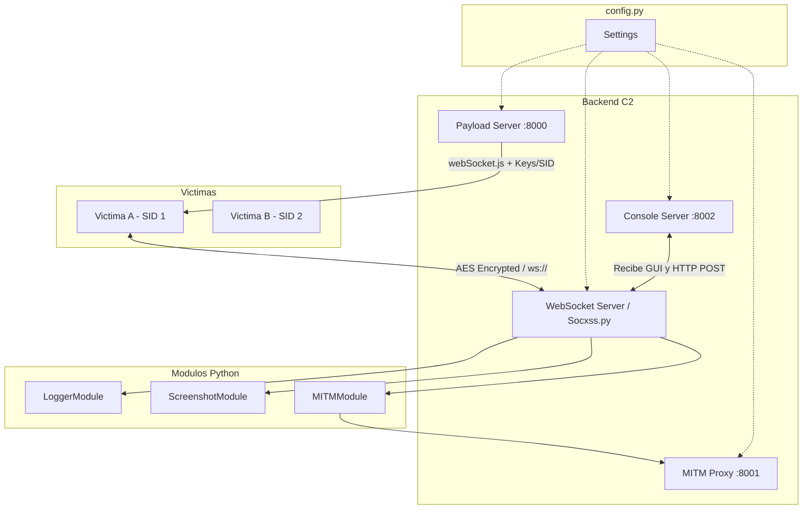

# Arquitectura de SOXSS (v2.0)

## Objetivo
SOXSS es un sistema de Comando y Control (C2) basado en XSS que combina un servidor HTTP de payloads, un servidor WebSocket, una consola web interactiva y un payload JavaScript dinámico (`webSocket.js`) que se ejecuta en el navegador de la víctima. La comunicación principal ocurre por WebSocket y emplea cifrado simétrico AES-256 distribuido por sesión.

## Componentes Principales

### 1) Configuración Centralizada (`config.py`)
- Responsabilidad: Gestionar todos los hosts y puertos del sistema de forma independiente (ej: `HTTP_PORT`, `WS_PORT`, `CONSOLE_PORT`, `MITM_PORT`).

### 2) Servidor WebSocket (`Socxss.py`)
- Responsabilidad: Aceptar conexiones WebSocket, descifrar mensajes, enrutar por módulo de backend y enviar respuestas.
- Tecnología: Manejo asíncrono moderno (`websockets.asyncio`).
- Handshake y Autenticación: Cada cliente tiene su propia clave e IV generados dinámicamente y asociados a un `sid` (Session ID). El mensaje entrante incluye un campo `type` para decidir el módulo.

### 3) Servidor HTTP de Payloads (`server/server.py`)
- Responsabilidad: Servir archivos estáticos y entregar dinámicamente el payload `webSocket.js` inyectando host, puertos, clave e IV únicos en tiempo de ejecución.

### 4) Consola Web (Operador)
- Backend (`modules/ConsoleServer.py`): Expone el servidor web HTTP para la administración general.
- Frontend (`console/`): Interfaz web en `index.html` (con `console.js`, `clientList.js` y `console.css`) de estética "Dark Glass", que brinda terminal, previsualización viva de capturas y un registro indexado de víctimas.
- Flujo: Permite rastrear víctimas simultáneamente. Transforma llamadas HTTP POST en mensajes enrutados hacia las víctimas por WebSocket.

### 5) Payload JavaScript (Cliente)
- Puntos de inyección (`server/webSocket.js`): Instancia el WebSocket al servidor usando su identificador en el path `/{sid}` y orquesta el descifrado y ejecución de los comandos base (`OK`, `eval`, `load`, `disable`).
- Persistencia (`server/scripts/link2fetch.js`): Mantiene la sesión viva secuestrando `fetch` y la History API para navegar la red interna de la víctima sin recargar la pestaña.
- Modularidad Auxiliar: Se complementa inyectando bajo demanda scripts desde `server/scripts/*.js` (capturas de pantalla, interceptadores).

### 6) MITM Proxy (Opcional)
- Responsabilidad: Usar el navegador de la víctima como puente de paso para interactuar con la Intranet usando la sesión autorizada.
- Componentes: Servidor `modules/MITMServer.py` y pasarela interna `modules/MITMModule.py` actuando como intermediario.

## Módulos del Backend (Python)
Las expansiones heredan de `Module` (en `modules/abstractModule.py`) y utilizan `handleMessage` para el procesado.
- `ConsoleInWeb` (`modules/consoleModule.py`): Módulo por defecto.
- `Logger` (`modules/loggerModule.py`): Recepción de exfiltración de teclado.
- `ScreenshotModule` (`modules/screenshotModule.py`): Procesamiento y almacenamiento visual.
- `MITMModule` (`modules/MITMModule.py`): Captura y almacenado temporal de respuestas `fetch`.

## Gestión de Datos y Comandos
- **Comandos C2** (`modules/consoleComands/`): Operaciones maestras como `eval` (inyección cruda JS), `load` (carga de complementos), `screenshot`, `mitm`, `downloadFile`, registradas unificadamente en `getComands.py`.
- **Almacenamiento por Sesión (SID)**:
  - Capturas y vistas: `console/screenshots/{sid}.png` y carpetas asociadas (`console/cache/`).
  - Logs de pulsaciones: `console/logs/{sid}.log`.

## Flujos de Ejecución

### Inicio y Conexión
1) `Socxss.py` levanta los sub-servicios HTTP, WebSocket y Consola.
2) La víctima recibe el inyectable mediante URL y abre el WebSocket contra `ws://.../{sid}`.
3) El servidor extrae el SID, busca el esquema AES correspondiente, asocia los sockets en `socksUtil` y la consola web notifica una nueva conexión.

### Transferencia de Órdenes
1) `ConsoleInWeb` envía mensajes en texto plano desde el _frontend_, que se codifican en tramas JSON (`type`, `msg`) cifradas usando AES con el IV de la sesión.
2) El navegador víctima rompe el cifrado y usa el motor `eval` o módulos como `html2canvas` para extraer resultados.
3) Empaqueta asíncronamente y los envía de retorno. `Socxss.py` descifra y el gestor de módulos los enruta a su clase respectiva (como almacenar imágenes o guardar logs).

## Diagrama (Mermaid)

## Extensibilidad
- Nuevas capacidades en cliente: añadir `scripts/*.js` y registrarlos en el frontend.
- Nuevos roles de servidor: extender una clase en `modules/` e instanciar nuevos procesadores lógicos en `getModules.py`.
- Nuevos comandos: extender en `modules/consoleComands/` (agregando herencia `AbstractComand`) y presentarlos en la vista general desde `getComands.py`.
