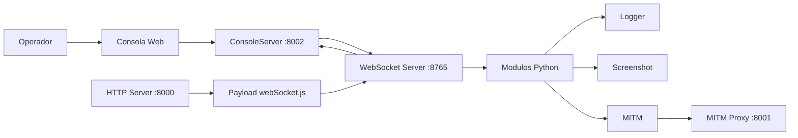

# Arquitectura de SOXSS

## Objetivo
SOXSS es un sistema de comando y control basado en XSS que combina un servidor HTTP, un servidor WebSocket, una consola web y un payload JavaScript que se ejecuta en el navegador de la victima. La comunicacion principal ocurre por WebSocket y usa cifrado simetrico.

## Componentes principales

### 1) Servidor WebSocket (Python)
- Archivo de entrada: Socxss.py
- Responsabilidad: aceptar conexiones WebSocket, descifrar mensajes, enrutar por modulo y enviar respuestas.
- Puerto: 8765.
- Seleccion de modulo: el mensaje entrante incluye un campo type que decide el modulo a usar; si no existe, se usa el modulo por defecto.

### 2) Servidor HTTP de payloads (Python)
- Archivo: server/server.py
- Responsabilidad: servir archivos estaticos desde server/ y entregar webSocket.js con variables dinamicas (host, puertos, clave e IV).
- Puerto: 8000.

### 3) Consola web (Python + HTML/JS)
- Backend de consola: modules/ConsoleServer.py
- Frontend: console/index.html, console/console.js, console/console.css, console/clientList.js
- Puerto: 8002.
- Flujo: la consola envia comandos via HTTP POST; el backend traduce el comando en mensajes para el cliente WebSocket actual.

### 4) Payload JavaScript (cliente)
- Archivo: server/webSocket.js
- Responsabilidad: abrir WebSocket al servidor, descifrar mensajes, ejecutar comandos y devolver resultados.
- Comandos base: OK, eval, load, disable.
- Comandos extra: se inyectan via scripts auxiliares (server/scripts/*.js) cargados con load.

### 5) MITM (opcional)
- Modulo: modules/MITMModule.py
- Servidor: modules/MITMServer.py
- Objetivo: usar el navegador de la victima como proxy para navegar recursos con sus cookies.
- Puerto: 8001 para proxy interactivo.

## Modulos del backend
Los modulos son clases que heredan de Module en modules/abstractModule.py y exponen handleMessage para procesar entradas.

- ConsoleInWeb (modules/consoleModule.py)
  - Modulo por defecto.
  - Inicia el servidor de consola y transmite respuestas al panel web.

- Logger (modules/loggerModule.py)
  - Guarda entradas del navegador en archivos input_<ip>.log.

- ScreenshotModule (modules/screenshotModule.py)
  - Recibe una imagen base64, la guarda en screenshots/ y en console/cache/ para previsualizacion.

- MITMModule (modules/MITMModule.py)
  - Guarda respuestas de fetch en una cache para servir via el proxy.

El enrutamiento de modulos se define en modules/getModules.py.

## Comandos de consola
Los comandos se encuentran en modules/consoleComands/ y se registran en modules/consoleComands/getComands.py.

Ejemplos:
- eval: ejecuta JS en el cliente.
- load: carga un script desde el servidor.
- screenshot: captura pantalla.
- downloadFile: descarga un archivo en la maquina de la victima.
- change, list: gestion de conexiones.

## Cifrado y transporte
- El payload y el servidor intercambian mensajes cifrados con AES.
- cryptoUtil genera la clave e IV y server/server.py los inserta en server/webSocket.js al servirlo.
- Los mensajes entrantes se descifran en Socxss.py antes del enrutamiento al modulo.

## Flujos de ejecucion

### Inicio del sistema
1) Socxss.py inicia el servidor HTTP (8000) y el WebSocket (8765).
2) ConsoleInWeb inicia el servidor de consola (8002).
3) El operador abre la consola web y selecciona un cliente.

### Conexion de cliente
1) La victima carga webSocket.js desde el servidor HTTP.
2) webSocket.js abre un WebSocket al servidor.
3) El servidor agrega el socket a socksUtil y confirma la conexion.

### Ejecucion de comandos
1) La consola envia un comando al servidor de consola (HTTP POST).
2) ConsoleInWeb traduce el comando a un mensaje cifrado y lo envia al cliente actual.
3) El payload ejecuta la accion y envia la salida cifrada de vuelta.
4) El modulo correspondiente procesa la respuesta y la consola la muestra.

### MITM interactivo
1) Se envia el comando mitm al cliente con un recurso objetivo.
2) El cliente hace fetch con sus cookies y devuelve contenido al servidor.
3) MITMServer expone el contenido via un endpoint proxy en 8001.

## Estructura de directorios (resumen)
- Socxss.py: punto de entrada del servidor WebSocket.
- server/: servidor HTTP, payload y scripts auxiliares.
- console/: UI web para la consola.
- modules/: modulos y servidores auxiliares.
- screenshots/: capturas recibidas.

## Diagrama (Mermaid)

## Extensibilidad
- Para agregar nuevas capacidades, crear un script en server/scripts/ que registre un nuevo comando en _webs_comands_ y un modulo en Python que procese la respuesta si corresponde.
- Agregar el comando a la consola en modules/consoleComands/ y registrar en getComands.py si se requiere un comando del lado del operador.
