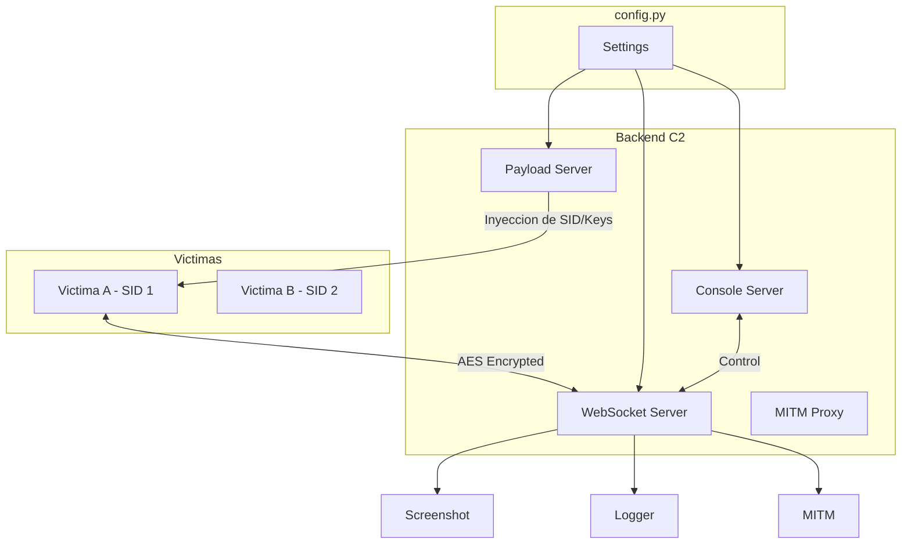

# Arquitectura de SOXSS (v2.0)

## Objetivo
SOXSS es un sistema de Comando y Control (C2) basado en XSS que combina un servidor de payloads (HTTP), un servidor C2 (WebSocket), una consola web de gestión y un payload JavaScript dinámico. La comunicación está protegida por cifrado AES-256 per-session.

## Componentes Principales

### 1) Configuración Centralizada (`config.py`)
- Responsabilidad: Gestionar todos los hosts y puertos del sistema de forma independiente.
- Parámetros: `HTTP_PORT`, `WS_PORT`, `CONSOLE_PORT`, `MITM_PORT`.

### 2) Servidor WebSocket (`Socxss.py`)
- Responsabilidad: Aceptar conexiones WebSocket, descifrar mensajes, enrutar por módulo y enviar respuestas.
- Tecnología: Usa `websockets.asyncio` para un manejo asíncrono moderno y eficiente.
- Handshake: Cada cliente tiene su propia clave e IV generados dinámicamente y asociados a un `sid` (Session ID).

### 3) Servidor HTTP de Payloads (`server/server.py`)
- Responsabilidad: Servir archivos estáticos y entregar `webSocket.js` con variables dinámicas inyectadas (host, puertos, clave e IV únicos).
- Puerto: Configurable vía `HTTP_PORT`.

### 4) Consola Web
- Backend (`modules/ConsoleServer.py`): Expone la API para el panel de control.
- Frontend (`console/`): Interfaz con estética "Dark Glass", previsualización de capturas en vivo y registro de actividad con marcas de tiempo.
- Gestión: Permite el seguimiento y control de múltiples víctimas simultáneamente.

### 5) Payload JavaScript (Cliente)
- Persistencia (`link2fetch.js`): Mantiene la sesión activa mediante el uso de `fetch` y la History API para navegar sin recargar la página completa.
- Modularidad: Carga scripts dinámicos para capturas (`ScreenshotModule`), registro de teclas (`LoggerModule`) y MITM.

## Gestión de Datos (Basada en SID)
El sistema organiza los datos mediante el identificador de sesión (`sid`):
- **Capturas**: Se guardan en `console/screenshots/{sid}.png`.
- **Logs**: Se guardan en `console/logs/{sid}.log`.

## Seguridad: Claves por Sesión
A diferencia de versiones anteriores, SOXSS genera un entorno criptográfico único por cada víctima:
1. Al solicitar el script `webSocket.js`, el servidor genera un `sid`.
2. Se crea un par Clave/IV aleatorio asociado a ese `sid` en memoria.
3. El payload se sirve con estos valores específicos.
4. El WebSocket conecta al path `/{sid}`, permitiendo al servidor recuperar la clave correcta.

## Diagrama de Arquitectura (Mermaid)

## Extensibilidad
- **Nuevas capacidades**: Crear scripts en `server/scripts/` y módulos en `modules/`.
- **Nuevos comandos**: Registrar en la consola web dentro de `modules/consoleCommands/` y en `getCommands.py`.
